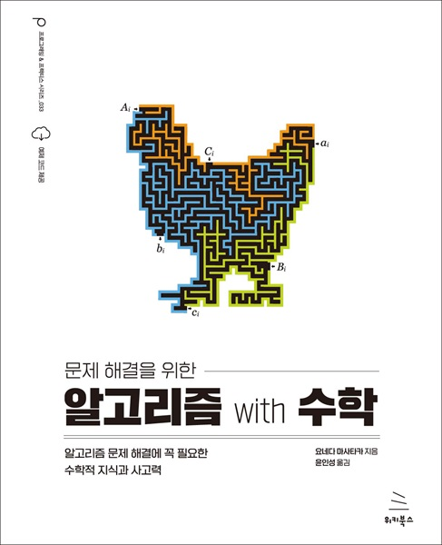

# 문제 해결을 위한 알고리즘 with 수학
### 알고리즘 문제 해결에 꼭 필요한 수학적 지식과 사고력

- **요네다 마사타카** 지음 | **윤인성** 옮김
- ISBN: 9791158394653
- 판형: 188*240*26mm
- 42,000원 | 2023년 9월 26일 발행 | 628쪽
- [책 홈페이지](https://wikibook.co.kr/algorithm-math/)
- [도서 미리보기]()
- [도서 관련 문의](https://wikibook.co.kr/support/contact/)

---

**알고리즘과 수학의 조화, 초보자를 위한 필수 가이드!**

이 책은 수학과 알고리즘을 함께 공부할 수 있는 완벽한 가이드입니다. 알고리즘은 프로그래밍을 통해 문제를 해결하기 위한 필수 도구이지만, 이를 이해하고 활용하기 위해서는 수학적 지식과 사고력이 필요합니다. 이 책에서는 중등학교부터 대학 교양 수준의 수학적 지식을 다루며, 알고리즘 학습에 필요한 내용을 자세히 설명합니다. 풍부한 도표와 꼼꼼하게 배치된 200 문항의 예제와 연습문제를 제공하여 내용을 보다 쉽게 이해하고 익힐 수 있습니다. 파이썬 언어로 실습하며 깃허브에서 C, C++, 자바 코드도 제공합니다. 또한 연습 문제에 대한 자세한 해설도 실려 있어 학습 과정을 더욱 효율적으로 만들어 줍니다.

논리적인 사고력과 문제 해결 능력을 향상시키고자 하는 분, 알고리즘과 이를 뒷받침하는 수학에 대해 기초부터 배우고 싶은 프로그래머, 엔지니어, 그리고 알고리즘 시험을 준비하는 분들에게 많은 도움이 될 것입니다. 

---
 
 ## 구입처
 
 - [예스24](http://www.yes24.com/Product/Goods/122544981)
 - [교보문고](https://product.kyobobook.co.kr/detail/S000209208966)
 - [인터파크](http://book.interpark.com/product/BookDisplay.do?_method=detail&sc.prdNo=356802374)
 - [알라딘](https://www.aladin.co.kr/shop/wproduct.aspx?ItemId=324967287)